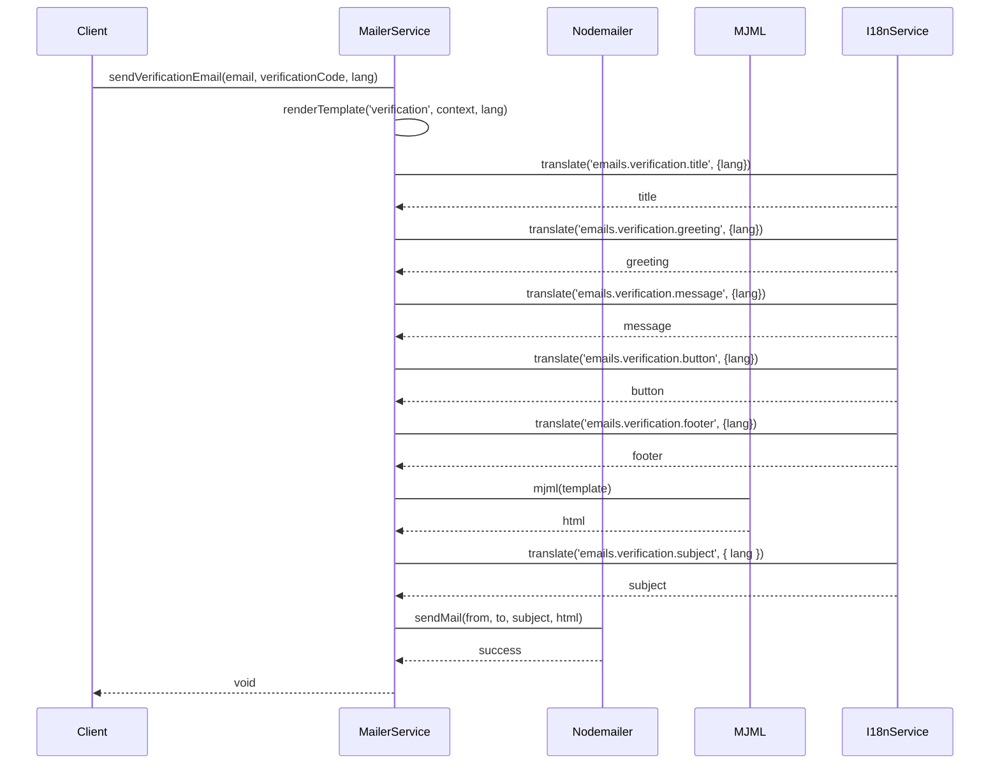

# Mailer Module

The Mailer Module is a comprehensive email service implementation in the NestJS application that handles various types of email communications using Nodemailer and MJML for responsive email templates.

## Features

- Multi-language support (English, Chinese, Japanese)
- Responsive email templates using MJML
- Template-based email rendering
- Support for multiple email types:
  - Verification emails
  - Welcome emails
  - Password reset emails

## Email Sending Flow



## Configuration

The module requires the following environment variables:

```env
MAIL_HOST=your-smtp-host
MAIL_PORT=587
MAIL_SECURE=false
MAIL_USER=your-email-username
MAIL_PASSWORD=your-email-password
MAIL_FROM=noreply@yourdomain.com
APP_URL=https://your-app-url.com
```

## Email Templates

The module uses MJML templates located in `src/i18n/emails/` for the following email types:

1. Verification Email (`verification.mjml`)
2. Welcome Email (`welcome.mjml`)
3. Forgot Password Email (`forgot-password.mjml`)

Each template supports multiple languages with translations stored in:
- `src/i18n/en/emails.json`
- `src/i18n/zh/emails.json`
- `src/i18n/ja/emails.json`

## Usage

### 1. Import the Module

```typescript
import { MailerModule } from './mailer/mailer.module';

@Module({
  imports: [MailerModule],
})
export class AppModule {}
```

### 2. Inject the Service

```typescript
import { MailerService } from './mailer/mailer.service';

@Injectable()
export class YourService {
  constructor(private readonly mailerService: MailerService) {}
}
```

### 3. Send Emails

#### Verification Email
```typescript
await mailerService.sendVerificationEmail(
  'user@example.com',
  'verification-code',
  'en' // optional, defaults to 'en'
);
```

#### Welcome Email
```typescript
await mailerService.sendWelcomeEmail(
  'user@example.com',
  'John Doe',
  'en' // optional, defaults to 'en'
);
```

#### Forgot Password Email
```typescript
await mailerService.sendForgotPasswordEmail(
  'user@example.com',
  'reset-token',
  30, // expiration time in minutes
  'en' // optional, defaults to 'en'
);
```