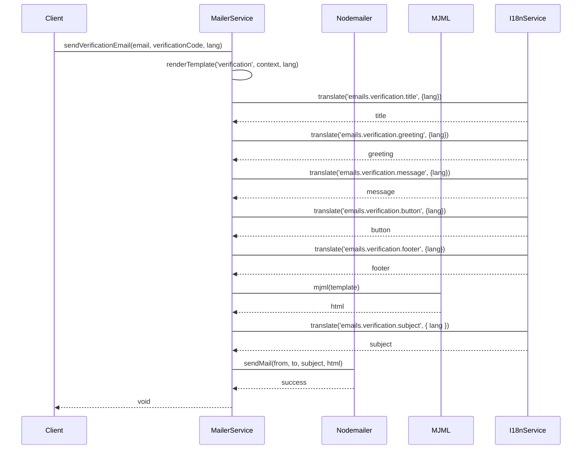

# 邮件模块

邮件模块是一个基于 NestJS 的综合性邮件服务实现，使用 Nodemailer 和 MJML 来处理各种类型的邮件通信，支持响应式邮件模板。

## 特性

- 多语言支持（英语、中文、日语）
- 使用 MJML 的响应式邮件模板
- 基于模板的邮件渲染
- 支持多种邮件类型：
  - 验证邮件
  - 欢迎邮件
  - 密码重置邮件

## 邮件发送流程



## 配置

该模块需要以下环境变量：

```env
MAIL_HOST=your-smtp-host
MAIL_PORT=587
MAIL_SECURE=false
MAIL_USER=your-email-username
MAIL_PASSWORD=your-email-password
MAIL_FROM=noreply@yourdomain.com
APP_URL=https://your-app-url.com
```

## 邮件模板

该模块使用位于 `src/i18n/emails/` 的 MJML 模板，支持以下邮件类型：

1. 验证邮件 (`verification.mjml`)
2. 欢迎邮件 (`welcome.mjml`)
3. 密码重置邮件 (`forgot-password.mjml`)

每个模板都支持多种语言，翻译文件存储在：
- `src/i18n/en/emails.json`
- `src/i18n/zh/emails.json`
- `src/i18n/ja/emails.json`

## 使用方法

### 1. 导入模块

```typescript
import { MailerModule } from './mailer/mailer.module';

@Module({
  imports: [MailerModule],
})
export class AppModule {}
```

### 2. 注入服务

```typescript
import { MailerService } from './mailer/mailer.service';

@Injectable()
export class YourService {
  constructor(private readonly mailerService: MailerService) {}
}
```

### 3. 发送邮件

#### 验证邮件
```typescript
await mailerService.sendVerificationEmail(
  'user@example.com',
  'verification-code',
  'en' // 可选，默认为 'en'
);
```

#### 欢迎邮件
```typescript
await mailerService.sendWelcomeEmail(
  'user@example.com',
  'John Doe',
  'en' // 可选，默认为 'en'
);
```

#### 密码重置邮件
```typescript
await mailerService.sendForgotPasswordEmail(
  'user@example.com',
  'reset-token',
  30, // 过期时间（分钟）
  'en' // 可选，默认为 'en'
);
```

## 邮件发送流程

1. 服务接收发送邮件的请求
2. 加载相应的 MJML 模板
3. 使用 I18nService 翻译所有模板变量
4. 替换动态内容（验证码、URL 等）
5. 将 MJML 转换为响应式 HTML
6. 使用 Nodemailer 发送邮件

## 错误处理

该服务包含全面的错误处理和日志记录：
- 模板渲染错误
- 邮件发送失败
- 翻译错误

所有错误都使用 NestJS 的内置 Logger 服务进行记录。

## 依赖项

- `nodemailer`: 用于发送邮件
- `mjml`: 用于响应式邮件模板
- `nestjs-i18n`: 用于国际化
- `@nestjs/config`: 用于配置管理

## 最佳实践

1. 始终提供后备语言（默认为 'en'）
2. 使用环境变量存储敏感信息
3. 保持邮件模板响应式且移动端友好
4. 尽可能同时包含 HTML 和纯文本版本
5. 使用有意义的主题行和清晰的行动号召按钮