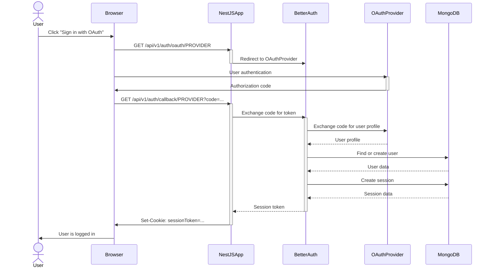

# OAuth Authentication Guide

This guide provides instructions for configuring and using the OAuth authentication system in this NestJS project.

## Authentication Flow



## Supported OAuth Providers

The application supports the following OAuth providers:

- Google
- GitHub
- Facebook
- Twitter (X)
- Microsoft
- Discord
- Apple
- LinkedIn
- GitLab
- Spotify
- Twitch
- Reddit
- Dropbox
- TikTok
- Kick
- Roblox
- VK

## Configuration

### Basic Configuration

Ensure you have the core OAuth settings in your environment:

```env
# Core OAuth configuration
OAUTH_PROVIDERS=github,google
OAUTH_CALLBACK_URL_BASE=http://localhost:7009/api/v1/auth/callback
OAUTH_COOKIE_NAME=auth_session
OAUTH_COOKIE_MAX_AGE=2592000
OAUTH_COOKIE_SECURE=false

# Provider credentials
GITHUB_CLIENT_ID=your_github_client_id
GITHUB_CLIENT_SECRET=your_github_client_secret
```

### Provider Configuration

Update your configuration in `src/config/envs/default.ts`:

```typescript
export default {
  oauth: {
    // List of enabled providers from env var (comma separated)
    providers: [
      ...(process.env.OAUTH_PROVIDERS || 'github')
        .split(',')
        .map(type => ({
          type: type.trim(),
          enabled: true,
        })),
    ],
    // Core OAuth settings
    baseConfig: {
      callbackUrl: process.env.OAUTH_CALLBACK_URL_BASE || 'http://localhost:7009/api/v1/auth/callback',
      cookieName: process.env.OAUTH_COOKIE_NAME || 'auth_session',
      cookieMaxAge: parseInt(process.env.OAUTH_COOKIE_MAX_AGE || '2592000', 10), // 30 days
      cookieSecure: process.env.OAUTH_COOKIE_SECURE === 'true',
    },
    // Provider configurations
    secrets: {
      github: {
        clientId: process.env.GITHUB_CLIENT_ID || '',
        clientSecret: process.env.GITHUB_CLIENT_SECRET || '',
      },
      // Add more providers as needed https://github.com/better-auth/better-auth
    },
  }
};
```

## Setting Up OAuth Applications

### General Steps

1. Create an application in the provider's developer console
2. Set the callback URL: `https://yourdomain.com/api/v1/auth/callback/[provider]`
3. Get the Client ID and Client Secret
4. Add them to your environment variables

### Common Provider Documentation Links

- [GitHub](https://github.com/settings/developers)
- [Google](https://console.cloud.google.com/)
- [Facebook](https://developers.facebook.com/)
- [Twitter](https://developer.twitter.com/)
- [Microsoft](https://portal.azure.com/)
- [Discord](https://discord.com/developers/applications)
- [Apple](https://developer.apple.com/)

## Usage

To initiate a login flow, redirect users to:

```
/api/v1/auth/login/[provider]
```

Where `[provider]` is one of the supported provider types listed above.

## API Endpoints

- **Get Available Providers**: `GET /better-auth/providers`
- **Get Session**: `GET /better-auth/session`

## Security Considerations

- Keep all client secrets secure and never expose them in client-side code
- Use environment variables for all sensitive information
- Regularly rotate secrets according to each provider's best practices
- Consider implementing additional security measures like PKCE for public clients 