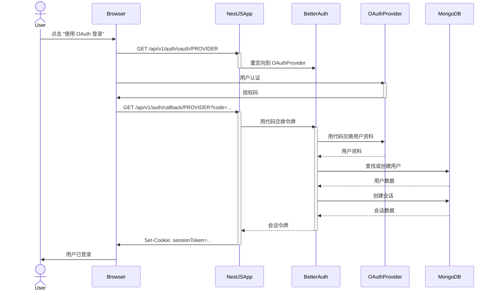

# OAuth 认证指南

本指南提供了在 NestJS 项目中配置和使用 OAuth 认证系统的说明。

## 认证流程



## 支持的 OAuth 提供商

应用程序支持以下 OAuth 提供商：

- Google
- GitHub
- Facebook
- Twitter (X)
- Microsoft
- Discord
- Apple
- LinkedIn
- GitLab
- Spotify
- Twitch
- Reddit
- Dropbox
- TikTok
- Kick
- Roblox
- VK

## 配置

### 基本配置

确保在环境中设置了核心 OAuth 配置：

```env
JWT_SECRET=your-secret-key
ALLOWED_ORIGINS=http://localhost:3000,https://yourdomain.com
```

### 提供商配置

在 `src/config/envs/default.ts` 中更新配置：

```typescript
export default {
  oauth: {
    providers: [
      { type: 'github', enabled: true },
      { type: 'google', enabled: true },
      // 添加其他提供商
    ],
    secrets: {
      github: {
        clientId: process.env.GITHUB_CLIENT_ID,
        clientSecret: process.env.GITHUB_CLIENT_SECRET,
      },
      // 添加其他提供商配置
    },
    defaults: {
      microsoft: { tenantId: 'common' },
      vk: { apiVersion: '5.131' },
      tiktok: { scope: 'user.info.basic' },
    }
  }
};
```

## 设置 OAuth 应用

### 通用步骤

1. 在提供商的开发者控制台创建应用
2. 设置回调 URL: `https://yourdomain.com/api/v1/auth/callback/[provider]`
3. 获取 Client ID 和 Client Secret
4. 添加到环境变量

### 常见提供商文档链接

- [GitHub](https://github.com/settings/developers)
- [Google](https://console.cloud.google.com/)
- [Facebook](https://developers.facebook.com/)
- [Twitter](https://developer.twitter.com/)
- [Microsoft](https://portal.azure.com/)
- [Discord](https://discord.com/developers/applications)
- [Apple](https://developer.apple.com/)

## 使用

启动登录流程:

```
/api/v1/auth/login/[provider]
```

其中 `[provider]` 可以是任何支持的提供商类型。

## API 端点

- **获取可用提供商**: `GET /better-auth/providers`
- **获取会话信息**: `GET /better-auth/session`

## 安全注意事项

- 保持所有客户端密钥的安全，不要在客户端代码中暴露
- 使用环境变量存储所有敏感信息
- 定期轮换密钥
- 考虑为公共客户端实现 PKCE 等额外安全措施 